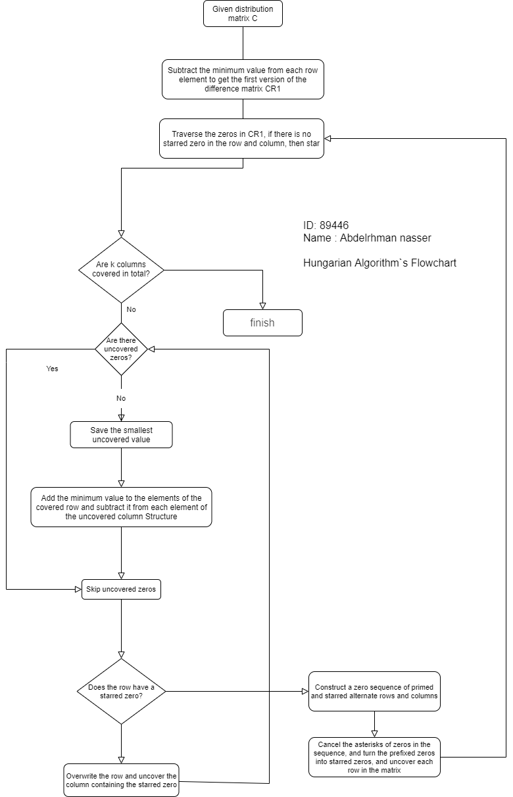

# Hungarian-Algorithm
The Hungarian algorithm consists of the four steps below. The first two steps are executed once,
 while Steps 3 and 4 are repeated until an optimal assignment is found. 
 The input of the algorithm is an n by n square matrix with only nonnegative elements.

## Hungarian-Algorithm STEPS:
Step 0: Create a cost matrix called n × m n\times mnXm Matrix, where each element represents the n nn One of the workers is assigned to m mmThe cost of one job.
Rotate the matrix so that there are at least as many columns as there are rows, and makek = min ⁡ (n, m) k=\min(n,m)k=min ( n ,m ).

### Step 1: 
For each row of the matrix, find the smallest element and subtract it from each element in that row. Go to step 2.

### Step 2: 
Find zero in the result matrix (z zz). If there is no starred zero in its row and column, it willz zzStar. Repeat this operation for each element in the matrix. Go to step 3.

### Step 3: 
Cover the columns that contain starred zeros.
If covered in total k kkColumn, the asterisked zero represents a complete unique allocation set. In this case, please go to "Finish";
Otherwise, go to step 4.

### Step 4:
Find an uncovered zero and prime it.
If there are no asterisked zeros in the row containing the primed zero, go to step 5.
Otherwise, please overwrite the row and uncover the column containing the starred zero.
Continue in this way until there are no zeros left.
Save the smallest uncovered value, and then go to step 6.

### Step 5: 
Follow the steps below to construct a series of alternating primed and starred zeros.
make z0 ​ Indicates the uncovered primed zeros found in step 4. 
make z1 exepress z0	​ The starred zero in the column (if any).​
make z2 Express z1​ Add prime zero in the row (there will always be one).
Continue the sequence until the zero hour that is not starred in the column where the primed zero is added.
Cancel the asterisks of zeros in the sequence, and add stars to the apostrophes, erase all apostrophes and uncover every row in the matrix.
Go back to step 3.

### Step 6: 
Add the value found in step 4 to each element of each covered row, and subtract it from each element of each uncovered column.
Go back to step 4 without changing any stars, apostrophes, or overlay lines.
Done: The allocation pair is indicated by the position of an asterisked zero in the cost matrix.
ifC (i, j) C(i,j)C ( i ,j ) Is starred, it will be the same as the line i ii The associated element is assigned to the column j jj Associated elements.
In step 4, the possible situation is that there is an uncovered and primed zero.
If there is no asterisked zero in its row, the procedure goes to step 5;
if there is no uncovered zero at all, the procedure goes to step 6. 
Step 5 is the augmented path algorithm, and step 6 is to modify the cost matrix.
				HungarianAlgorithm::Solve
							|
							|
							|
							v
			HungarianAlgorithm::assignmentoptimal

## Hungarian-Algorithm Flowchart:

